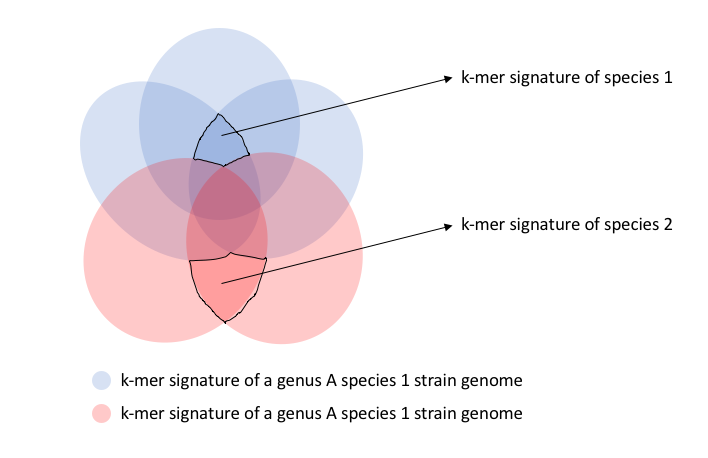

# Meeting notes
Having discussed the paper [Critical Assessment of Metagenome Interpretation -- a benchmark of metagenomics software](https://www.nature.com/articles/nmeth.4458), we looked over LINbase's potential in metagenomics analysis.  

It's currently difficult to well assemble the metagenomics data into genomes especially when there are closely related genomes (ANI>95%) in the same dataset. Since binning and taxonomy assignment are the downstream processes that uses the output of assembly, it is a very important step when investigating or trying to identify bacteria from different intra-species.

But can we skip the assembly step? I think it's possible and doable.  
Since LINgroups are representing taxonomic groups and beyond, we can find the markers or signature fragments of each LINgroups and we only need to see if a metagenomic read contains any of the markers or signature sequences. How to choose these markers or signatures? We can use k-mer. We already are using MinHash to compare how similar genomes are to each other content-wisely: a given size of k-mer signatures is generated for each genome, and a LINgroup definitely has a set of k-mer that is the intersection of all the individual k-mer signatures from its members. 

Like Lenny pointed out, the work depends on the level or the resolution of this database. If we want it to work at species level, we need to compare all the species of a genus. For example in the venn diagram, let's say there are 2 different species in genus A, shown by different colors, and each oval represents the k-mer signature of an individual genome, so there are 3 members in genus A species 1, and 2 members in genus A species 2.  
We need to calculate 

